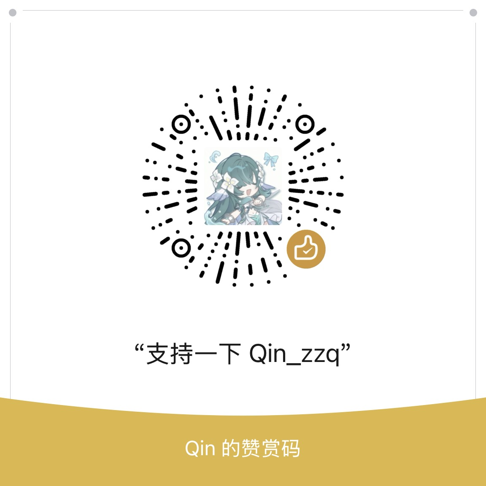

<!-- ───────────── Header ───────────── -->
<div align="center">


<a href="https://git.io/typing-svg">
  
</a>

<br/>


</div>

<p align="right">
  <a href="README-cn.md">🇨🇳 中文</a>
</p>

---

## 🧑‍💻 About Me

```yaml
name: Qin_zzq
aliases: [Qin, zzq]
location: Jiangsu, China
identity:
  - High School Student (surviving Gaokao)
  - OIer
  - Amateur Developer (projects: 90% unfinished)
favorite characters:
  - Nahida (Genshin Impact) — my beloved Dendro Archon ☘️
  - Columbina (Genshin Impact) — the mysterious Damselette 🕊️
languages: [C++, Python, JavaScript, HTML, CSS]
hobbies: [OI grinding, open-source tinkering, building random fun tools, Genshin / maimai / phigros]
setup:
  - MacBook Air 2017 (Intel) — still on Big Sur 💀
  - Boot Camp Windows 10
motto: "お可愛いこと。"
```

> A curious and passionate beginner who codes between homework sessions. Most projects are *perpetually WIP* because school is relentless — but the grind never stops! ヾ(=･ω･=)o

---

## 🚀 Featured Projects

| Project | What it is | Stack |
| :-- | :-- | :-- |
| [**SeewoAutoLogin**](https://github.com/Pro-Qin/SeewoAutoLogin) | Seewo whiteboard SSO gateway auto-login (standalone WPF) | `C#` |
| [**classroom-pet-system**](https://github.com/Pro-Qin/classroom-pet-system) | Classroom electronic pet system | `TypeScript` |
| [**Reasonix-SonettoHere**](https://github.com/Pro-Qin/Reasonix-SonettoHere) | AI coding agent + SonettoHere domain tool ecosystem | `Go` |
| [**IslandCaller_Pre**](https://github.com/Pro-Qin/IslandCaller_Pre) | Lightweight class roll-caller built on ClassIsland | `C#` |
| [**MacBook-Touchpad-Visualizer**](https://github.com/Pro-Qin/MacBook-Touchpad-Visualizer) | Precision touchpad raw-input visualizer for Boot Camp | `C#` |
| [**Poem-App**](https://github.com/Pro-Qin/Poem-App) | Ancient poetry query, search and recitation app | `Flutter` |

<sub>👉 More in the <a href="https://github.com/Pro-Qin?tab=repositories">repository list</a></sub>

---

## 📊 GitHub Stats

<h3>🔥 Streak</h3>

<p align="center">
  
</p>

<h3>💻 Profile Stats</h3>

<p align="center">
  
  
</p>

<h3>📈 Activity Graph</h3>

<p align="center">
  
</p>

---

## 🛠️ Tech Stack

<h3>Languages</h3>

<p align="center">
  <a href="https://isocpp.org/"></a>&nbsp;
  <a href="https://www.python.org/"></a>&nbsp;
  <a href="https://developer.mozilla.org/en-US/docs/Web/JavaScript"></a>&nbsp;
  <a href="https://www.typescriptlang.org/"></a>&nbsp;
  <a href="https://learn.microsoft.com/dotnet/csharp/"></a>&nbsp;
  <a href="https://go.dev/"></a>&nbsp;
  <a href="https://www.rust-lang.org/"></a>&nbsp;
  <a href="https://dart.dev/"></a>
</p>

<h3>Tools & Platforms</h3>

<p align="center">
  <a href="https://dev.w3.org/html5/"></a>&nbsp;
  <a href="https://developer.mozilla.org/en-US/docs/Web/CSS"></a>&nbsp;
  <a href="https://vuejs.org/"></a>&nbsp;
  <a href="https://code.visualstudio.com/"></a>&nbsp;
  <a href="https://git-scm.com/"></a>&nbsp;
  <a href="https://github.com/"></a>&nbsp;
  <a href="https://www.markdownguide.org/"></a>&nbsp;
  <a href="https://www.linux.org/"></a>&nbsp;
  <a href="https://www.microsoft.com/windows/"></a>
</p>

<p align="center">
  
  
  
  
  
  
  
  
  
  
</p>

---

## 🐍 Contribution Snake


<sub>🐍 generated with <a href="https://github.com/Platane/snk">Platane/snk</a></sub>

---

## 🌐 Find Me

<p align="center">
  <a href="https://github.com/Pro-Qin"></a>&nbsp;
  <a href="https://space.bilibili.com/1849305981"></a>&nbsp;
  <a href="mailto:workqin@foxmail.com"></a>&nbsp;
  <a href="https://tool.gljlw.com/qq/?qq=849806583"></a>
</p>

---

## 💖 Support Me

These little tools eat most of the time I have left after problem sets. If one of them saved you some work, you can buy me a bubble tea — it is the reason I keep tinkering between homework and the Gaokao 🧋

<div align="center">
  <picture>
    <source media="(prefers-color-scheme: dark)" srcset="assets/wechat-reward-dark.jpg" />
    
  </picture>
</div>

<p align="center"><sub>Scan with WeChat · the image follows your GitHub light/dark theme</sub></p>

---

<div align="center">
  
  <br/>
  <strong>お可愛いこと。</strong>
</div>
